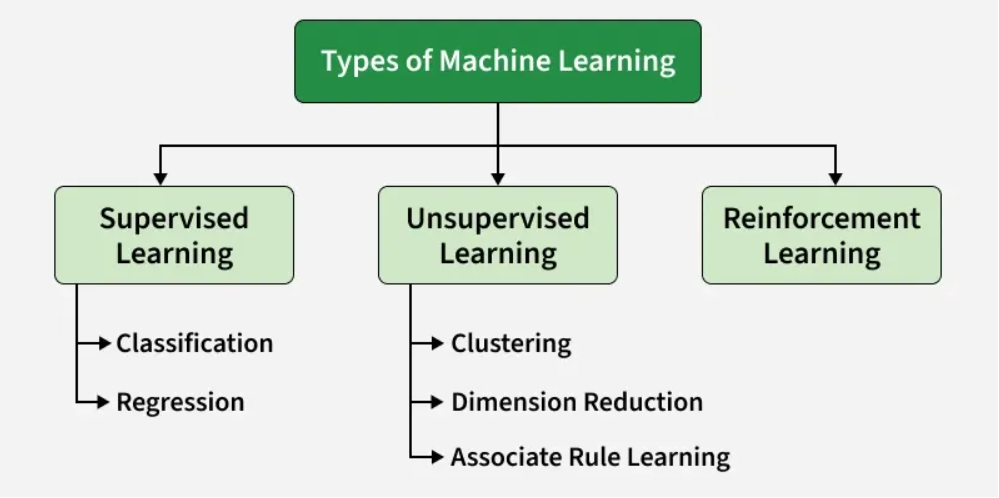

# Machine Learning

Machine Learning (ML) is a branch of Artificial Intelligence (AI) that enables computers to learn patterns from data and make predictions or decisions without being explicitly programmed for every scenario.

| Traditional Programming | Machine Learning          |
| ----------------------- | ------------------------- |
| Programmer writes rules | Computer learns rules     |
| Rules + Data → Answer   | Data + Answers → Model    |
| Best for fixed logic    | Best for finding patterns |
| Example: Calculator     | Example: Face recognition |

# Why ML

1. Solves complex problems that traditional ptogramming cant
2. Handling Large Volumes of Data
3. Automate Repetitive Tasks
4. Personalized User Experience
5. Self Improvement in Performance

# Types of ML

1. Supervised learning

   learning from labelled data

2. unsupervised learning

   learning by finding pattern in data without labels

3. Reinforcement Learning

   Learn through trial and error

# Challenges

- ML models learn from training data and if the data is biased, model’s decisions can be unfair so it’s important to select and monitor data carefully.
- Since it depends on large amounts of data, there is a risk of sensitive information being exposed so protecting privacy is important.
- Complex ML models can be difficult to understand which makes it difficult to explain why they make certain decisions. This can affect trust and accountability.
- Automation may replace some jobs so retraining and helping workers learn new skills is important to adapt to these changes.
